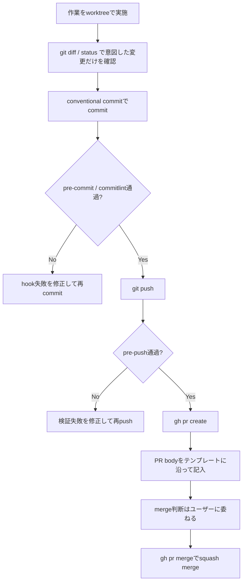
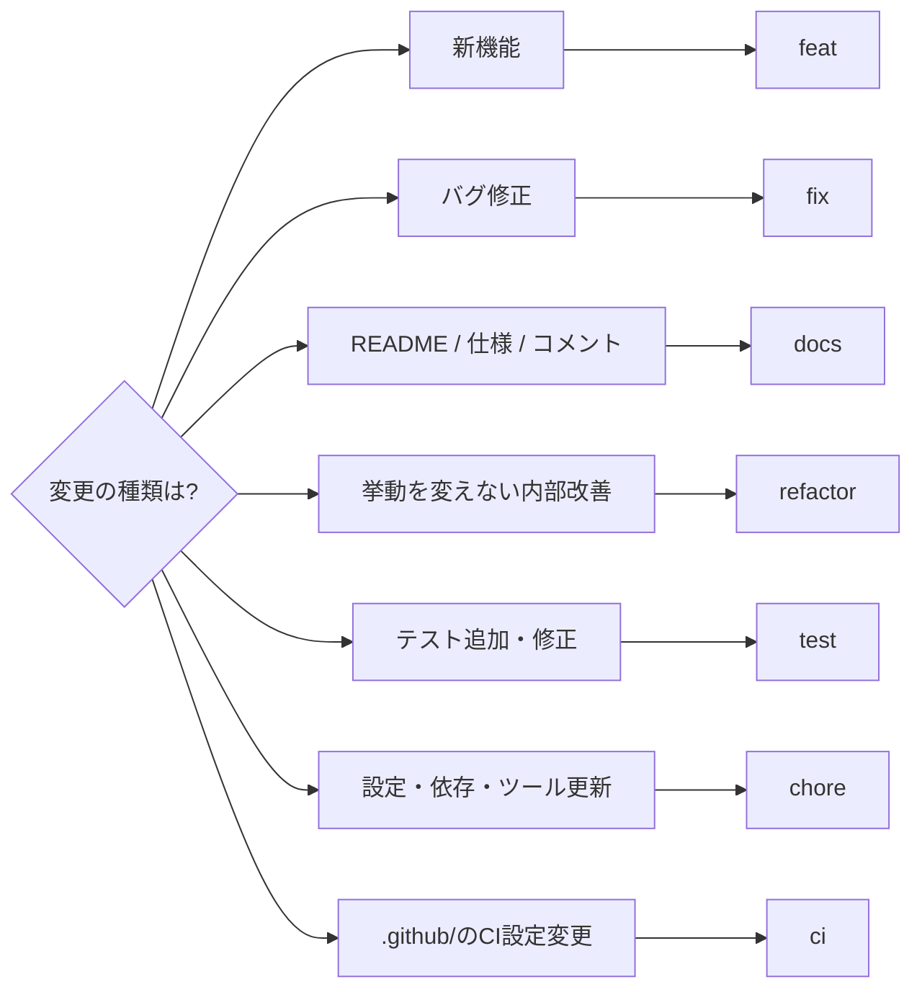
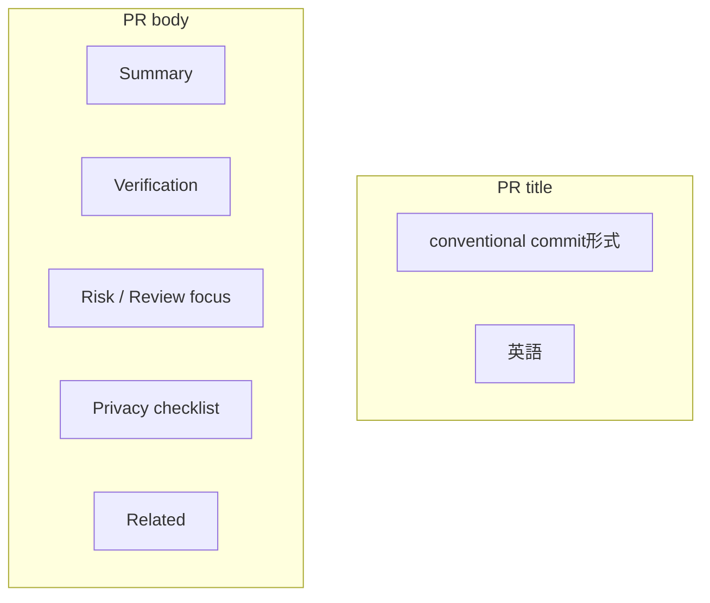

# PR / Commit workflow

commit messageとPRはconventional commitに統一する。commitlintの設定(`commitlint.config.ts`)が正本なので、本書はその解釈と判断基準だけを記す。

## 全体の流れ

作業中のcommit・push・PR作成・mergeは、ユーザーが明示的に依頼したときだけ行う。git hookを無効化しない(`never-disable-git-hooks`を参照)。

## Conventional commit

commit messageは次を満たす。

- `type: subject` 形式。
- subjectは英語、末尾のピリオドなし、簡潔に。
- scopeは任意。迷ったら空欄。

### typeの選択

### 迷いどころの正解

| 変更内容                    | type                   | 理由                           |
| --------------------------- | ---------------------- | ------------------------------ |
| `lefthook.yml` 変更         | `chore`                | `.github/`ではない設定ファイル |
| `package.json` 依存更新     | `chore(deps)`          | 依存関係の更新                 |
| GitHub Actions workflow変更 | `ci`                   | `.github/`配下のみ             |
| 新しい変換コマンド追加      | `feat(commands)`       | ユーザー向け新機能             |
| バグ修正                    | `fix`                  | 誤動作の是正                   |
| リファクタリング            | `refactor(operations)` | 挙動を変えない構造改善         |

commitlintは`type-enum`として`feat, fix, docs, refactor, test, chore, ci, build, perf, style, revert`を許可する。`build`は`chore`で十分なことが多く、まれにしか使わない。

## PR作成

PR titleはcommit messageと同じくconventional commit形式(`feat: ...`など)。PR bodyは`.github/PULL_REQUEST_TEMPLATE.md`に従う。

### PR bodyの各項目

- **Summary**: 何を変えたか、なぜかをリポジトリ相対パス付きで2–5 bullet。
- **Verification**: 実行した正確なコマンドと結果。未検証事項とその理由も明記する。検証方法は `graphics-workbench-verify` を参照。
- **Risk / Review focus**: 1行で。該当なしなら "None."。
- **Privacy checklist**: ローカルマシン固有の情報がPR bodyに含まれていないことを確認。
- **Related**: Task / Closes を記載。

言語はADR-0011に従い、PR titleは英語、PR bodyは英語を基本とする。複雑な判断やメンテナ向け補足には日本語を併記してよい。

## マージ

- リポジトリはmerge commitを許可していないため、`gh pr merge --squash --delete-branch`でsquash mergeする。
- マージ後、localのmainを更新する(`git switch main && git pull --ff-only`)。
- PRのmerge指示がない限り、作成しただけで停止する。

## 確認項目

- commit messageがconventional commitに適合する。
- PR bodyの全項目が埋まっている。
- 意図しないファイルがcommitに含まれていない。
- CI不要の変更か、必要な検証が済んでいるか。
